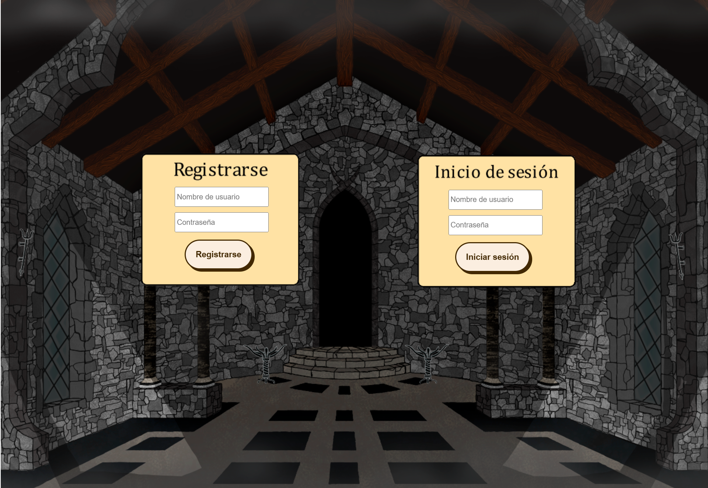

**LINK A LA PLATAFORMA EN LA QUE SE HA SUBIDO EL JUEGO**  

https://acholito.itch.io/la-maldicin

En esta etapa del proyecto se han introducido varias mejoras que refuerzan tanto la jugabilidad como la experiencia visual y funcional del juego. A continuación, se detallan las mejoras realizadas hasta esta etapa, especificando su origen y evolución:  

  
-**Animaciones de movimiento mejoradas:** En la fase 2, el personaje humano carecía de animaciones al caminar, moviéndose de  forma rígida y sin fluidez, dando la sensación de que el personaje flotaba en lugar de estar andando. En la fase 5, se 
 actualizaron los sprites del personaje humano incluyendo un spritesheet con animaciones más detalladas y fluidas, logrando   un desplazamiento más natural y estéticamente atractivo.  

-**Rediseño de la pantalla de inicio de sesión:** La interfaz de inicio de sesión de la fase 3 incluía opciones como editar contraseña y borrar usuario, lo que resultaba algo confuso y falto de seguridad, ya que cualquier persona podía realizar esas acciones sin ser el propio usuario. Además de que tenía una estética básica y con algunos errores. En esta última versión, las opciones fueron eliminadas y trasladadas al menú de ajustes. Se mejoró el diseño visual, enfocándose únicamente en las opciones de crear usuario e iniciar sesión, con una interfaz limpia y clara.  

  

*Imagen 1: Pantalla LogIn antigua*  

  

*Imagen 2: Pantalla LogIn nueva*  

-**Actualización del menú de ajustes:** En la fase 2 no se implementó un menú de ajustes. En la fase 3, se incorporó el menú de ajustes pero era muy limitado y solo permitía modificar el volumen, por ello en la fase 5 hemos decidido implementar en este menú dos funcionalidades que se eliminaron de la pantalla de inicio de sesión: editar contraseña y borrar usuario; mejorando así no solo la experiencia y personalización del jugador sino también la seguridad del juego, ya que solo se pueden modificar el usuario y la contraseña si eres el dueño de la cuenta y has iniciado sesión previamente.  

  

*Imagen 3: Menú de ajustes antiguo*  

  

*Imagen 4: Menú de ajustes nuevo*  

-**Chat mejorado:** En la fase 3 el chat funcionaba correctamente, pero carecía de algunos elementos para hacerlo más completo. En la fase 5, se añadieron notificaciones visuales que indican la recepción de nuevos mensajes, así como la cantidad de estos. Asegurando que los jugadores estén siempre al tanto de la actividad en el chat.  

  

*Imagen 5: Notificación de nuevo mensaje*  

-**Implementación del tiempo límite:** La idea del tiempo límite no estaba planteada cuando se comenzó a desarrollar el juego, por ello aunque fue propuesta en la fase 2, no se había implementado hasta la fase 5. La falta de tiempo límite hacía que el juego careciera de presión y urgencia, afectando al dinamismo. En la fase 5 se introdujo el tiempo límite en los niveles. Además, se añadió una pantalla de derrota que aparece al agotarse el tiempo, informando al jugador del fracaso y ofreciendo una opción para regresar al menú principal.  

-**Menú de pausa:** En la fase 2 no existía un menú de pausa, lo que impedía que los jugadores pudieran pausar el juego para hacer ajustes o descansar. En la fase 3 se implementó un menú de pausa accesible desde la partida. Este menú incluye opciones para reanudar el juego, volver al menú principal o acceder a los ajustes.  

*Imagen 6: Menú de pausa*  

-**Pantalla de finalizar nivel:** En la fase 2 existía una pantalla que notificaba al jugador al finalizar un nivel, pero no existía una opción clara para regresar al menú principal; por lo que el jugador tenía que reiniciar el juego. En la fase 3 se modificó la pantalla al finalizar cada nivel, permitiendo a los jugadores regresar al menú principal. Esto mejora la experiencia de navegación y transición entre niveles.  

  

*Imagen 7: Pantalla de final de nivel*  

-**Sprites del personaje humano:** En la fase 2 el sprite del personaje humano se confundía fácilmente con el fondo, lo que dificultaba identificar al personaje en el escenario. En la fase 3 se rediseñó el sprite del personaje humano cambiando el color de la capa a un tono azul, para llamar la atención del jugador, asegurando que se destaque mejor en el entorno del juego y sea fácilmente reconocible.  

  

*Imagen 8: Humano con capa negra*  

  

*Imagen 9: Humano con capa azul*  

-**Menú principal:** En la fase 2 el menú principal era muy simple y no incluía opciones adicionales que permitieran acceder a configuraciones más detalladas como ajustes. En la fase 3 se rediseñó el menú principal, añadiendo el botón de Ajustes.  

  

*Imagen 10: Menú inicial antiguo*  

  

*Imagen 11: Menú inicial nuevo*

-**Mensajes de retroalimentación:** En la fase 5 se implementaron mejoras significativas en la pantalla de login para mejorar la experiencia del usuario con respecto de la fase 3. Una de las principales modificaciones fue la incorporación de mensajes de retroalimentación, los cuales alertan al jugador de problemas durante el proceso de inicio de sesión o creación de cuenta. 

  

*Imagen 12: Mensaje de retroalimentación*  

Cada una de estas mejoras resolvió problemas específicos de fases anteriores y mejoró tanto la jugabilidad como la estética general del juego, lo que permite a los jugadores disfrutar de una experiencia más fluida y atractiva.

