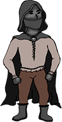

# PracticaJeRGrupo5
## LA MALDICIÓN
JUEGOS EN RED  

DISEÑO Y DESARROLLO DE VIDEOJUEGOS - URJC

 

 **PATATA GAMES**  
 
Realizado por:  

Ana María Caamaño del Amo, correo de la universidad: am.caamano.2022@alumnos.urjc.es, cuenta de GitHub: MagaBlanca46  
Jesús Mercado Rioja, correo de la universidad: j.mercado.2022@alumnos.urjc.es, cuenta de GitHub: JesusMerRio  
Lara Sánchez Sanz, correo de la universidad: l.sanchezsa.2022@alumnos.urjc.es, cuenta de GitHub: LaraSs06  
Javier Martín Mulero, correo de la universidad: j.martinm.2022@alumnos.urjc.es: , cuenta de GitHub: AchoLito  
Unai Pastrana Torres, correo de la universidad: u.pastrana.2022@alumnos.urjc.es, cuenta de GitHub: UnaiPas04

### 1. CONCEPTO DEL JUEGO
***

*La Maldición* es un videojuego cooperativo multijugador para dos jugadores. Cada jugador controla a un personaje con habilidades únicas: uno es un fantasma y el otro es un humano. Ambos deben colaborar para resolver puzles, desbloquear áreas y escapar de un castillo. El fantasma puede atravesar paredes y manipular ciertos objetos, mientras el humano puede interactuar con el mundo físico. Los jugadores deben coordinar sus acciones y utilizar sus habilidades complementarias para progresar.

### 2. GÉNERO
***

*La Maldición* pertenece al género de puzles con elementos de aventura gráfica. Se enfoca en la resolución de problemas y la exploración a través de la colaboración entre dos jugadores, cada uno con habilidades diferentes y complementarias. El diseño del juego está enfocado en la comunicación y el trabajo en equipo, ya que los jugadores deberán combinar sus talentos únicos para superar desafíos.
El tono del juego es misterioso y tenso, pero no terror puro. El diseño visual y mecánicas están orientadas a generar una sensación de suspenso y exploración, más que de miedo intenso.

### 3. ESTILO VISUAL
***

*La Maldición* presenta un estilo visual en 2D, ambientado en un castillo medieval con iluminación tenue y detalles sombríos que crean un ambiente misterioso. Los personajes destacan en el entorno oscuro, con el humano en tonos más naturales y el fantasma con un brillo espectral. La paleta de colores utiliza tonos apagados y efectos visuales sutiles para resaltar los objetos interactivos, generando una atmósfera inmersiva pero accesible a un público amplio. Se utilizará una vista cenital o “top-down”, que permitirá a los jugadores visualizar el entorno desde una perspectiva aérea, lo que facilitará la resolución de puzles.

#### 3.1 REFERENCIAS

La perspectiva será similar a la de las imágenes 1, 2 y 3, pero con un estilo gráfico inspirado en las imágenes 4, 5 y 6.  

  
  
  

*Imágenes 1, 2 y 3: Referencias de vista “Top - Down”*      

  
   
  

*Imágenes 4, 5 y 6: Referencias del estilo visual.*  

#### 3.2 DISEÑOS FINALES

  

*Imágenes 7 y 8: Diseño final del escenario del primer nivel.*

### 4. PROPÓSITO Y PÚBLICO OBJETIVO
***

El público objetivo de *La Maldición* son jugadores a partir de 12 años, interesados en experiencias cooperativas y de resolución de puzles. Está diseñado tanto para jugadores que disfrutan de los juegos que fomentan la colaboración de forma casual como para aficionados de juegos cooperativos más experimentados que buscan una experiencia diferente.  

Aunque incluye elementos de misterio y ambientación sombría, *La Maldición* no recurre a imágenes perturbadoras o violencia explícita, lo que lo hace adecuado para público más amplio, incluidas personas jóvenes. 

### 5. PLATAFORMA
***

*La Maldición* está diseñado para jugarse en PC. 

### 6. ALCANCE
***

El juego está diseñado para ofrecer una experiencia cooperativa de corta a mediana duración, con una campaña principal que abarca entre 3 y 5 niveles progresivamente más complejos. 

### 7. MECÁNICAS PRINCIPALES
***

Las mecánicas principales se basan en la cooperación entre los dos jugadores que controlan los personajes con mecánicas y habilidades únicas y complementarias: uno juega como humano y el otro como fantasma. Además, cada personaje tiene sus propias mecánicas que reflejan sus características dentro del mundo y son cruciales para la resolución de puzles.  

**Resolución de puzles:** La resolución de puzles es la mecánica principal del juego, que combina las mecánicas y habilidades de los dos jugadores para desarrollarse. Algunos de los puzles que puede incluir el juego son:   

* Puzles de puertas dobles o invisibles.  

* Puzles de combinación de objetos.  

* Activación de mecanismos de forma simultánea.  

* Protección contra trampas o enemigos.  

**Enemigos y trampas:** A lo largo del juego los jugadores se encontrarán con dos tipos de peligros. Por un lado, enemigos que deambulan por ciertas zonas y que son incapaces de ver al fantasma, por lo que este podrá generar distracciones u obstáculos para que no ataquen al jugador humano. Por otro lado, trampas que pueden ser o no visibles por el humano, lo que hace que ambos jugadores tengan que combinar sus habilidades para sortearlas.  

#### 7.1. MECÁNICAS DEL FANTASMA  

**Invisible a enemigos:** Su apariencia transparente permite que este jugador no pueda ser visto por enemigos.    

**Atravesar paredes:** El fantasma podrá atravesar ciertos tipos de muros, lo que le permitirá explorar áreas que el humano no puede.  

**Posesión de objetos:** A la hora de resolver algunos acertijos, el fantasma necesitará poseer ciertos objetos para ayudarse a sí mismo o al humano.  

**Detección de elementos invisibles:** Podrá ver objetos que a simple vista el humano no podrá ver. Estos objetos pueden ser esenciales para resolver los puzles.  

#### 7.2. MECÁNICAS DEL HUMANO   

**Manipulación de objetos:** El humano podrá interactuar con objetos en el mundo físico, ya sea moviéndose, cogiéndolos o usándolos para resolver puzles.  

**Resolución de puzles:** Este jugador será el único que pueda activar mecanismos manuales o resolver acertijos en el mundo físico.   

**Visión reducida:** Su visión está limitada al mundo físico, haciendo que no pueda interactuar con objetos o peligros ocultos sin la ayuda del fantasma.  

Todas las mecánicas propuestas en los apartados anteriores tienen como objetivo permitir que la experiencia de juego sea mucho más inmersiva y que la resolución de puzles alcance una nueva perspectiva.

### 8. NARRATIVA
***
La narrativa de *La Maldición* gira en torno a una maldición ancestral que ha condenado a un rey y sus súbditos a vagar eternamente por un castillo olvidado. El juego permite a los jugadores investigar el castillo y descubrir la trama oculta entre sus paredes.  

*La Maldición* empieza cuando el jugador humano despierta encerrado en una celda en un castillo antiguo y allí se encuentra con un fantasma desorientado que no recuerda quién es ni cómo murió. Ambos se unen para escapar del castillo, pero pronto descubren que una maldición envuelve el lugar afectando a todos sus habitantes.   

El castillo pertenecía a un joven rey que, por su inmadurez y arrogancia, condenó a su reino a una  maldición eterna. Todos los habitantes están atrapados cumpliendo sus roles incluso después de la muerte, por ello los guardias se han convertido en esqueletos. El fantasma es en realidad el rey, aunque él lo desconoce al principio.  

Según los jugadores avanzan, descubren la historia del castillo y del pasado del fantasma. La trama se va revelando a través de los puzles y enemigos que enfrentan. La revelación final muestra que el humano es en realidad un esqueleto más, afectado por la maldición del castillo. 

### 9. PERSONAJES
***

#### 9.1. FANTASMA

##### 9.1.1. HISTORIA
El fantasma es uno de los dos personajes jugables del videojuego, si bien durante el juego no se conoce mucho de su historia, al final del mismo se revela que en vida el fantasma era el rey del castillo, que murió por una maldición que le condenó a estar ligado al castillo por toda la eternidad.  

La única oportunidad del fantasma para escapar es romper la maldición que le ata a dicho embrujado lugar.

##### 9.1.2. APARIENCIA
La apariencia del fantasma está fuertemente inspirada en la cultura popular, su aspecto está basado en la imagen tradicional de un fantasma como es la de la sabana flotando. Esto es así para facilitar que el jugador sepa desde un primer momento que el personaje está muerto.   

*Imagen 9: Referencia para la apariencia del fantasma.*   

  

*Imagen 10: Diseño final del fantasma.*

#### 9.2. HUMANO

##### 9.2.1. HISTORIA 
El bandido es el segundo personaje jugable del videojuego. Al igual que pasa con el fantasma, durante el juego no se conoce mucho de su historia, para así al final del mismo revelar que todo este tiempo el bandido ha estado muerto, ya que falleció cuando intentó saquear el castillo; sin embargo, este no lo sabe y actúa como lo haría en vida. 

##### 9.2.2. APARIENCIA
El bandido va vestido con unos pantalones negros y una camisa blanca, propia de la época en la que vivió; por encima de dicha ropa lleva una larga capa con capucha que le permite cubrirse la cara para pasar desapercibido. Esta capa cumple dos propósitos, el primero es aportar un trasfondo al personaje, ya que da a entender que tiene un pasado misterioso. Por otra parte, cumple un propósito con la narrativa, dado que impide que el jugador sepa si el personaje está muerto o no.    

*Imágenes 11 y 12: Referencias para la apariencia del humano.*  

  

*Imagen 13: Diseño final del humano.*

#### 9.3. ENEMIGOS 

##### 9.3.1. HISTORIA

Los antiguos guardias del castillo se vieron arrastrados por la maldición puesta sobre el rey. Están condenados a vagar por el castillo eternamente realizando las mismas tareas que realizaron en vida. Al igual que el bandido, no son conscientes de que están muertos.

##### 9.3.2. APARIENCIA

Los soldados del castillo van vestidos con unas armaduras que les cubren todo el cuerpo, dichas armaduras son propias de la época en la que murieron los soldados. Al igual que con el bandido, su vestimenta provoca que los jugadores desconozcan si los guardias están vivos o muertos.  

*Imagen 10: Referencias para la apariencia de los enemigos.*

### 10. OBJETOS
***

A lo largo del videojuego, los personajes irán recogiendo diferentes objetos que les ayudarán a superar los puzles propuestos y avanzar por las diferentes salas del castillo.

### 11. NIVELES
***

Como ya se ha mencionado, el juego tendrá entre 3 y 5 niveles. Cada uno de los niveles estarán asociados a las diferentes habitaciones del castillo, siendo cada escenario un nivel distinto. En ellos se encontrarán los objetos necesarios para poder avanzar al siguiente.  

#### 11.1. NIVEL 1  

En el primer nivel, se introduce a los jugadores a la historia y al sistema de puzles y mecánicas del juego y establece la necesidad de cooperación entre el humano y el fantasma. Abientado en un calabozo oscuro, este nivel desafía a los jugadores a trabajar juntos para resolver un acertijo basado en antorchas, estatuas y mecanismos ocultos, que finalmente les permitirá avanzar a la siguiente área del castillo.  

##### 11.1.1. OBJETIVO DEL NIVEL  

Los jugadores deben encender una serie de antorchas y alinear correctamente las estatuas de la sala para abrir una puerta secreta que les permitirá escapar. La solución del puzle involucra encontrar pistas, manipular objetos físicos y activar mecanismos sobrenaturales, aprovechando las habilidades únicas de ambos personajes.  

##### 11.1.2. ELEMENTOS DEL NIVEL  

**Antorcha:** Las antorchas, una vez encendidas, revelan pistas visuales en el suelo que indican hacia qué dirección deben mirar las estatuas de la sala.  

**Estatuas:** Cada estatua puede rotarse y deben colocarse mirando en una dirección concreta revelada por los antorchas. Una de estas estatuas está bloqueada destrás de una puerta bloqueada a la que solo puede acceder el fantasma. Cuando las estatuas se colocan correctamete esta puerta se abre, permitiendo al humano acceder y recoger un objecto del suelo: un trozo de palanca.  

**Palanca rota:** En la sala hay una palanca incompleta que el humano debe reparar utilizando el trozo de palanca encontrado. Una vez reparada, esta palanca permite mover una estatua que oculta una puerta secreta.  

**Palanca oculta del fantasma:** AL final del puzle, el fantasma debe localizar y activar una palanca oculta que desbloquea la puerta secreta final, permitiendo a ambos jugadores salir de la cámara.

### 12. LOGROS
***

En esta sección, estableceremos una lista de todos los logros que están disponibles en el juego. La mayoría de estos se conseguirán al ir completando las diferentes pantallas, pero existirán otros que dependan de encontrar ciertos objetos o detalles ocultos.

### 13. INTERFAZ
***

La interfaz tendrá un estilo similar a la estética del juego, siendo simple y fácil de entender para los jugadores, además de que no obstruirá la pantalla a la hora de jugar. El juego incluirá unos botones en el menú inicial, siendo estos el de jugar, opciones, controles y salir; un menú de pausa, un inventario y bocadillos de diálogo.

### 14. MÚSICA Y EFECTOS DE SONIDO
***

La música en *La Maldición* está diseñada para sumergir a los jugadores en la atmósfera inquietante de un castillo sin distraerlos de la jugabilidad. Una música suave y tensa creará un efecto de suspense y misterio que incrementará la tensión de los jugadores conforme se vayan adentrando en el castillo y los peligros aumenten. Además de la música, habrá efectos de sonido que permitirán crear un atmósfera mucho más inmersiva, como el soplo del viento o susurros de voces que hagan que el jugador se sienta dentro del castillo, pero sin llegar a asustarlo, para así reflejar la estética y género del juego.

### 15. IMÁGENES DE REFERENCIA
***

https://www.craiyon.com/image/N0GfFcb8So-2AAmaaE1NZA  

https://commons.nicovideo.jp/works/nc286416  

https://www.freepik.es/vector-gratis/coleccion-fantasmas-halloween-dibujados-mano_18953723.htm  

https://www.freepik.es/vector-premium/castillo-ilustracion-fondo-juego-torre_64818939.htm  

### 16. CRÉDITOS DE LA MÚSICA Y SONIDOS
***  

**Música:**  
https://www.youtube.com/watch?v=1rNzn-R_Eg4  

**Botón:**  
https://pixabay.com/es/sound-effects/click-effect-86995/  

**Mover estatua:**  
https://www.youtube.com/watch?v=zOnMIjl19g8  

**Abrir puerta:**  
https://www.youtube.com/watch?v=OohvbnXhtXA
