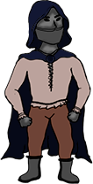
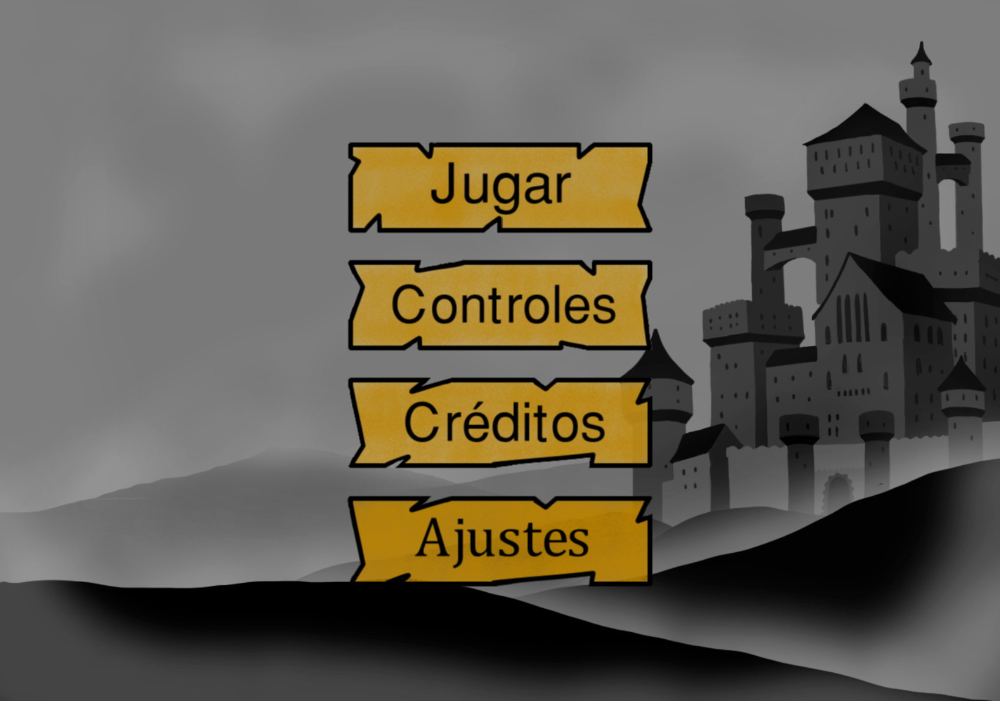
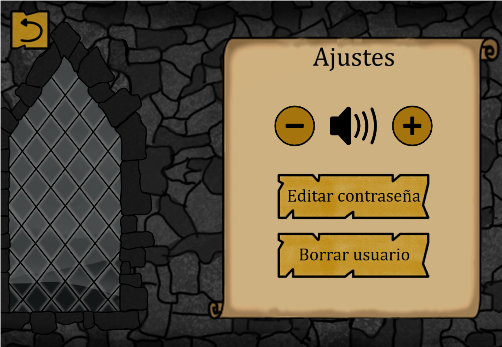
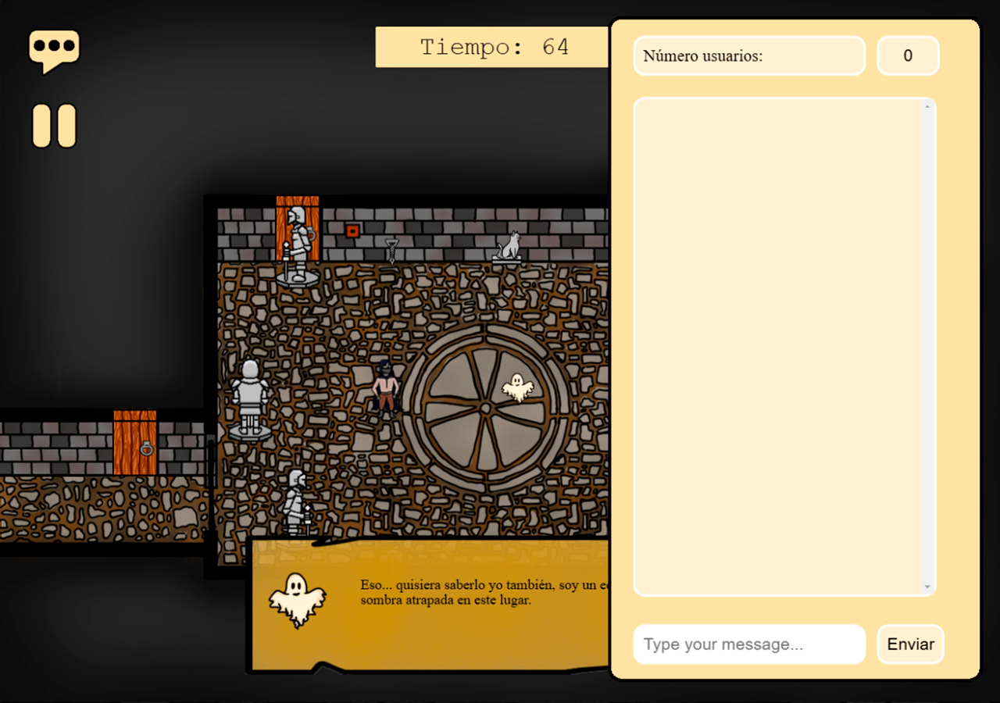
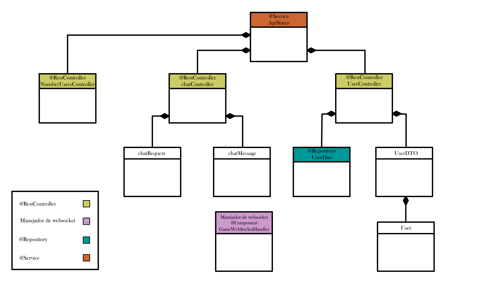

**LINK DEL VÍDEO DE YOUTUBE**  
https://youtu.be/4YPFXzmn-2A

# PracticaJeRGrupo5
## LA MALDICIÓN
JUEGOS EN RED  

DISEÑO Y DESARROLLO DE VIDEOJUEGOS - URJC

 

 **PATATA GAMES**  
 
Realizado por:  

Ana María Caamaño del Amo, correo de la universidad: am.caamano.2022@alumnos.urjc.es, cuenta de GitHub: MagaBlanca46  
Jesús Mercado Rioja, correo de la universidad: j.mercado.2022@alumnos.urjc.es, cuenta de GitHub: JesusMerRio  
Lara Sánchez Sanz, correo de la universidad: l.sanchezsa.2022@alumnos.urjc.es, cuenta de GitHub: LaraSs06  
Javier Martín Mulero, correo de la universidad: j.martinm.2022@alumnos.urjc.es: , cuenta de GitHub: AchoLito  
Unai Pastrana Torres, correo de la universidad: u.pastrana.2022@alumnos.urjc.es, cuenta de GitHub: UnaiPas04  

### 1. CAMBIOS  
***  

Mientras se ha realizado este documento se ha tomado la decisión de cambiar el sprite del jugador humano. Se considera que este era difícil de distinguir con el fondo y se ha modificado para que llame más la atención.  

Se han añadido nuevas pantallas como el LogIn, los ajustes, el chat y la pausa, facilitando así la navegación y personalización.  

### 2. CONCEPTO DEL JUEGO
***

*La Maldición* es un videojuego cooperativo multijugador para dos jugadores. Cada jugador controla a un personaje con habilidades únicas: uno es un fantasma y el otro es un humano. Ambos deben colaborar para resolver puzles, desbloquear áreas y escapar de un castillo. El fantasma puede atravesar paredes y manipular ciertos objetos, mientras el humano puede interactuar con el mundo físico. Los jugadores deben coordinar sus acciones y utilizar sus habilidades complementarias para progresar.  

La licencia utilizada es Apache 2.0.

### 3. GÉNERO
***

*La Maldición* pertenece al género de puzles con elementos de aventura gráfica. Se enfoca en la resolución de problemas y la exploración a través de la colaboración entre dos jugadores, cada uno con habilidades diferentes y complementarias. El diseño del juego está enfocado en la comunicación y el trabajo en equipo, ya que los jugadores deberán combinar sus talentos únicos para superar desafíos.
El tono del juego es misterioso y tenso, pero no terror puro. El diseño visual y mecánicas están orientadas a generar una sensación de suspenso y exploración, más que de miedo intenso.

### 4. ESTILO VISUAL
***

*La Maldición* presenta un estilo visual en 2D, ambientado en un castillo medieval con iluminación tenue y detalles sombríos que crean un ambiente misterioso. Los personajes destacan en el entorno oscuro, con el humano en tonos más naturales y el fantasma con un brillo espectral. La paleta de colores utiliza tonos apagados y efectos visuales sutiles para resaltar los objetos interactivos, generando una atmósfera inmersiva pero accesible a un público amplio. Se utilizará una vista cenital o “top-down”, que permitirá a los jugadores visualizar el entorno desde una perspectiva aérea, lo que facilitará la resolución de puzles.

#### 4.1 REFERENCIAS

La perspectiva será similar a la de las imágenes 1, 2 y 3, pero con un estilo gráfico inspirado en las imágenes 4, 5 y 6.  

  
  
  

*Imágenes 1, 2 y 3: Referencias de vista “Top - Down”*      

  
   
  

*Imágenes 4, 5 y 6: Referencias del estilo visual.*  

#### 4.2 DISEÑOS FINALES

  

*Imágenes 7 y 8: Diseño final del escenario del primer nivel.*

### 5. PROPÓSITO Y PÚBLICO OBJETIVO
***

*La Maldición* está dirigido a un rango de jugadores establecido con PEGI 7, interesados en experiencias cooperativas y de resolución de puzles. Está diseñado tanto para jugadores que disfrutan de los juegos que fomentan la colaboración de forma casual como para aficionados de juegos cooperativos más experimentados que buscan una experiencia diferente.  

Aunque incluye elementos de misterio y ambientación sombría, *La Maldición* no recurre a imágenes perturbadoras o violencia explícita, lo que lo hace adecuado para público más amplio, incluidas personas jóvenes. 

### 6. PLATAFORMA
***

*La Maldición* está diseñado para jugarse en PC. 

### 7. ALCANCE
***

El juego está diseñado para ofrecer una experiencia cooperativa de corta a mediana duración, con una campaña principal que abarca entre 3 y 5 niveles progresivamente más complejos.  

Respecto a la monetización, el juego será de compra única sin posibilidad de DLCs en un futuro.

### 8. MECÁNICAS PRINCIPALES
***

Las mecánicas principales se basan en la cooperación entre los dos jugadores que controlan los personajes con mecánicas y habilidades únicas y complementarias: uno juega como humano y el otro como fantasma. Además, cada personaje tiene sus propias mecánicas que reflejan sus características dentro del mundo y son cruciales para la resolución de puzles.  

**Movimiento:** El personaje del humano se puede mover utilizando las teclas W (movimiento hacia delante), A (movimiento hacia la izquierda), D (movimiento hacia la derecha) y S (movimiento hacia atrás). El personaje del fantasma se mueve mediante las flechas del teclado, pudiendo moverse en las mismas direcciones que el humano.  

**Interacción:** El humano puede recoger objetos e interactuar con elementos del juego mediante la tecla E, mientras que el fantasma interactúa con la tecla del ENTER.  

El humano y el fantasma no interactúan de la misma manerda con el entorno, cada uno de ellos posee habilidades únicas que los diferencian el uno del otro, por ejemplo el fantasma puede atravesar paredes y el humano puede recoger objetos y guardarlos en el inventario.  

**Diálogos:** A lo largo del juego hay una serie de diálogos entre el fantasma y el humano, que permiten no solo avanzar en la historia sino también guiar al jugador a lo largo del juego. Para poder avanzar los diálogos, se debe hacer uso de la tecla ESPACIO. 

**Resolución de puzles:** La resolución de puzles es la mecánica principal del juego, que combina las mecánicas y habilidades de los dos jugadores para desarrollarse. Algunos de los puzles que puede incluir el juego son:   

* Puzles de puertas dobles o invisibles.  

* Puzles de combinación de objetos.  

* Activación de mecanismos de forma simultánea.  

* Protección contra trampas o enemigos.  

**Enemigos y trampas:** A lo largo del juego los jugadores se encontrarán con dos tipos de peligros. Por un lado, enemigos que deambulan por ciertas zonas y que son incapaces de ver al fantasma, por lo que este podrá generar distracciones u obstáculos para que no ataquen al jugador humano. Por otro lado, trampas que pueden ser o no visibles por el humano, lo que hace que ambos jugadores tengan que combinar sus habilidades para sortearlas.  

#### 8.1. MECÁNICAS DEL FANTASMA  

**Invisible a enemigos:** Su apariencia transparente permite que este jugador no pueda ser visto por enemigos.    

**Atravesar paredes:** El fantasma podrá atravesar ciertos tipos de muros, lo que le permitirá explorar áreas que el humano no puede.  

**Posesión de objetos:** A la hora de resolver algunos acertijos, el fantasma necesitará poseer ciertos objetos para ayudarse a sí mismo o al humano.  

**Detección de elementos invisibles:** Podrá ver objetos que a simple vista el humano no podrá ver. Estos objetos pueden ser esenciales para resolver los puzles.  

#### 8.2. MECÁNICAS DEL HUMANO   

**Manipulación de objetos:** El humano podrá interactuar con objetos en el mundo físico, ya sea moviéndose, cogiéndolos o usándolos para resolver puzles.  

**Resolución de puzles:** Este jugador será el único que pueda activar mecanismos manuales o resolver acertijos en el mundo físico.   

**Visión reducida:** Su visión está limitada al mundo físico, haciendo que no pueda interactuar con objetos o peligros ocultos sin la ayuda del fantasma.  

Todas las mecánicas propuestas en los apartados anteriores tienen como objetivo permitir que la experiencia de juego sea mucho más inmersiva y que la resolución de puzles alcance una nueva perspectiva.

### 9. NARRATIVA
***
La narrativa de *La Maldición* gira en torno a una maldición ancestral que ha condenado a un rey y sus súbditos a vagar eternamente por un castillo olvidado. El juego permite a los jugadores investigar el castillo y descubrir la trama oculta entre sus paredes.  

*La Maldición* empieza cuando el jugador humano despierta encerrado en una celda en un castillo antiguo y allí se encuentra con un fantasma desorientado que no recuerda quién es ni cómo murió. Ambos se unen para escapar del castillo, pero pronto descubren que una maldición envuelve el lugar afectando a todos sus habitantes.   

El castillo pertenecía a un joven rey que, por su inmadurez y arrogancia, condenó a su reino a una  maldición eterna. Todos los habitantes están atrapados cumpliendo sus roles incluso después de la muerte, por ello los guardias se han convertido en esqueletos. El fantasma es en realidad el rey, aunque él lo desconoce al principio.  

Según los jugadores avanzan, descubren la historia del castillo y del pasado del fantasma. La trama se va revelando a través de los puzles y enemigos que enfrentan. La revelación final muestra que el humano es en realidad un esqueleto más, afectado por la maldición del castillo. 

### 10. PERSONAJES
***

#### 10.1. FANTASMA

##### 10.1.1. HISTORIA
El fantasma es uno de los dos personajes jugables del videojuego, si bien durante el juego no se conoce mucho de su historia, al final del mismo se revela que en vida el fantasma era el rey del castillo, que murió por una maldición que le condenó a estar ligado al castillo por toda la eternidad.  

La única oportunidad del fantasma para escapar es romper la maldición que le ata a dicho embrujado lugar.

##### 10.1.2. APARIENCIA
La apariencia del fantasma está fuertemente inspirada en la cultura popular, su aspecto está basado en la imagen tradicional de un fantasma como es la de la sabana flotando. Esto es así para facilitar que el jugador sepa desde un primer momento que el personaje está muerto.   

*Imagen 9: Referencia para la apariencia del fantasma.*   

  

*Imagen 10: Diseño final del fantasma.*

#### 10.2. HUMANO

##### 10.2.1. HISTORIA 
El bandido es el segundo personaje jugable del videojuego. Al igual que pasa con el fantasma, durante el juego no se conoce mucho de su historia, para así al final del mismo revelar que todo este tiempo el bandido ha estado muerto, ya que falleció cuando intentó saquear el castillo; sin embargo, este no lo sabe y actúa como lo haría en vida. 

##### 10.2.2. APARIENCIA
El bandido va vestido con unos pantalones negros y una camisa blanca, propia de la época en la que vivió; por encima de dicha ropa lleva una larga capa con capucha que le permite cubrirse la cara para pasar desapercibido. Esta capa cumple dos propósitos, el primero es aportar un trasfondo al personaje, ya que da a entender que tiene un pasado misterioso. Por otra parte, cumple un propósito con la narrativa, dado que impide que el jugador sepa si el personaje está muerto o no.    

*Imágenes 11 y 12: Referencias para la apariencia del humano.*  

  

*Imagen 13: Diseño final del humano.*

#### 10.3. ENEMIGOS 

##### 10.3.1. HISTORIA

Los antiguos guardias del castillo se vieron arrastrados por la maldición puesta sobre el rey. Están condenados a vagar por el castillo eternamente realizando las mismas tareas que realizaron en vida. Al igual que el bandido, no son conscientes de que están muertos.

##### 10.3.2. APARIENCIA

Los soldados del castillo van vestidos con unas armaduras que les cubren todo el cuerpo, dichas armaduras son propias de la época en la que murieron los soldados. Al igual que con el bandido, su vestimenta provoca que los jugadores desconozcan si los guardias están vivos o muertos.  

*Imagen 14: Referencias para la apariencia de los enemigos.*

### 11. OBJETOS
***

A lo largo del videojuego, los personajes irán recogiendo diferentes objetos que les ayudarán a superar los puzles propuestos y avanzar por las diferentes salas del castillo.

### 12. NIVELES
***

Como ya se ha mencionado, el juego tendrá entre 3 y 5 niveles. Cada uno de los niveles estarán asociados a las diferentes habitaciones del castillo, siendo cada escenario un nivel distinto. En ellos se encontrarán los objetos necesarios para poder avanzar al siguiente.  

#### 12.1. NIVEL 1  

En el primer nivel, se introduce a los jugadores a la historia y al sistema de puzles y mecánicas del juego y establece la necesidad de cooperación entre el humano y el fantasma. Abientado en un calabozo oscuro, este nivel desafía a los jugadores a trabajar juntos para resolver un acertijo basado en antorchas, estatuas y mecanismos ocultos, que finalmente les permitirá avanzar a la siguiente área del castillo.  

##### 12.1.1. OBJETIVO DEL NIVEL  

Los jugadores deben encender una serie de antorchas y alinear correctamente las estatuas de la sala para abrir una puerta secreta que les permitirá escapar. La solución del puzle involucra encontrar pistas, manipular objetos físicos y activar mecanismos sobrenaturales, aprovechando las habilidades únicas de ambos personajes.  

##### 12.1.2. ELEMENTOS DEL NIVEL  

**Antorcha:** Las antorchas, una vez encendidas, revelan pistas visuales en el suelo que indican hacia qué dirección deben mirar las estatuas de la sala.  

**Estatuas:** Cada estatua puede rotarse y deben colocarse mirando en una dirección concreta revelada por los antorchas. Una de estas estatuas está bloqueada destrás de una puerta bloqueada a la que solo puede acceder el fantasma. Cuando las estatuas se colocan correctamete esta puerta se abre, permitiendo al humano acceder y recoger un objecto del suelo: un trozo de palanca.  

**Palanca rota:** En la sala hay una palanca incompleta que el humano debe reparar utilizando el trozo de palanca encontrado. Una vez reparada, esta palanca permite mover una estatua que oculta una puerta secreta.  

**Palanca oculta del fantasma:** AL final del puzle, el fantasma debe localizar y activar una palanca oculta que desbloquea la puerta secreta final, permitiendo a ambos jugadores salir de la cámara.  

##### 12.1.3. IMAGEN DEL NIVEL  

  

*Imagen 15: Escenario del Nivel 1*

### 13. LOGROS
***

En esta sección, estableceremos una lista de todos los logros que están disponibles en el juego. La mayoría de estos se conseguirán al ir completando las diferentes pantallas, pero existirán otros que dependan de encontrar ciertos objetos o detalles ocultos.

### 14. INTERFAZ
***

La interfaz tendrá un estilo similar a la estética del juego, siendo simple y fácil de entender para los jugadores, además de que no obstruirá la pantalla a la hora de jugar. El juego incluirá unos botones en el menú inicial, siendo estos el de jugar, opciones, controles y salir; un menú de pausa, un inventario y bocadillos de diálogo.  

La interfaz incluye varios elementos que facilitan el control y la navegación tanto para el jugador que controla al humano como para el jugador que controla al fantasma. El diseño sigue una lógica de transición entre pantallas, con un flujo claro que se representa en el diagrama adjunto. Este flujo asegura que los jugadores puedan moverse de una pantalla a otra de manera fluida, ya sea al iniciar el juego, pausar, consultar información o avanzar al siguiente nivel.  

  

*Imagen 16: Diagrama de pantallas*  

#### 14.1 PANTALLA DE LOGIN  

La pantalla de login es la primera interacción del usuario con el juego permitiendo gestionar el acceso al juego. En esta pantalla el jugador podrá introducir su usuario y contraseña, así como realizar una serie de acciones con las opciones disponibles:  

**Registrarse:** Permite registrar un nuevo perfil.

**Iniciar sesión:** Valida los datos y accede al juego.  

  

*Imagen 17: Pantalla de LogIn*  

#### 14.2. PANTALLA DE TÍTULO  

La pantalla de título es la primera que los jugadores ven al iniciar el juego. Sirve como introducción visual y establece el tono del juego. Tiene un botón interactivo con el texto "Comenzar". Al interactuar con él, el juego lleva automáticamente a la pantalla de Menú de Inicio.  

  

*Imagen 18: Pantalla de título*

#### 14.3. MENÚ DE INICIO  

El menú principal contiene todas las opciones iniciales necesarias para comenzar la partida. Las opciones disponibles son:  
**Jugar:** Inicia el juego y lleva al primer nivel.  

**Controles:** Accede a la pantalla donde se explican los controles básicos de ambos personajes.  

**Ajustes:** Accede a la pantalla donde se pueden modificar los ajustes del juego.

**Créditos:** Muestra información sobre el equipo que ha desarrollado el juego.  

  

*Imagen 19: Menú de inicio del juego*  

*Imagen 20: Controles de cada jugador del juego*  

  

*Imagen 21: Créditos del juego*  

#### 14.4. PANTALLA DE SELECCIÓN DE PERSONAJES  

La pantalla de selección de personajes aparece después de que el jugador haya iniciado una partida y se encuentra a la espera de que el segundo jugador se conecte. Esta pantalla es fundamental para garantizar la asignación adecuada de roles, la cual está gestionada por WebSockets.  

Estos son los elementos de la pantalla:  

**Humano:** Botón para seleccionar el humano como personaje.  

**Fantasma:** Botón para seleccionar al fantasma como personaje.  

Estas son las funcionalidades de la pantalla:  

**Ambos jugadores eligen personaje:** Si ambos jugadores seleccionan un personaje diferente, la partida comenzará con los personajes elegidos. En caso de que dos jugadores seleccionen el mismo personaje saldrá un mensaje de advertencia avisando del problema.  

**Un jugador elige personaje y el otro no:** Si solo uno de los jugadores elige personaje, al otro se le asignará de forma automática el personaje restante.  

**Ningún personaje elegido:** Si ninguno de los dos jugadores elige personajes, se asignan de forma aleatoria.  

Cada vez que un jugador hace una elección o la cancela, este es notificado mediante un mensaje en pantalla.  

  

*Imagen 22: Pantalla de selección de personaje*

#### 14.5. PANTALLA DE PAUSA  

El menú de pausa aparece cuando el usuario presiona en alguna de las pantallas de niveles el botón en la esquina superior izquierda que tiene el símbolo de pausa. Esta pantalla permite a los jugadores detener el juego, acceder a las opciones de ajustes y salir al menú principal. Estos son los elementos de esta pantalla:  

**Reanudar:** Regresa al juego en el punto donde se dejó.  

**Menú principal:** Vuelve al menú de inicio.  

**Ajustes:** Accede a la pantalla donde se pueden modificar los ajustes del juego.  

  

*Imagen 23: Menú de pausa*

#### 14.6. PANTALLA DE AJUSTES  

El menú de ajustes permite al jugador personalizar ciertos aspectos del juego para mejorar su experiencia. Las opciones son:  

**Volumen:** Ajusta el nivel de volumen del juego.    

**Editar contraseña:** Modifica la contraseña de un usuario existente.  

**Eliminar usuario:** Borra una cuenta tras confirmar la acción.  

  

*Imagen 24: Pantalla de ajustes*  

  

*Imagen 25: Pantalla de cambio de contraseña*  

  

*Imagen 26: Pantalla de borrar usuario*  

#### 14.7. PANTALLA DE CHAT  

La pantalla de chat se activa durante el juego presionando el botón en la esquina superior izquierda que tiene el símbolo de chat. Esta pantalla permite a los usuarios comunicarse mientras siguen en la partida. Los elementos principales de esta pantalla son:  

**Área de mensajes:** Muestra los mensajes escritos por ambos jugadores en tiempo real.  

**Campo de entrada:** En la parte inferior, hay un cuadro de texto donde el jugador puede escribir su mensaje.  

Si el jugador ha recibido un nuevo mensaje saldrá un icono de notificaciones sobre el icono de chat indicando la cantidad de mensajes.  

  

*Imagen 27: Chat del juego*

#### 14.8. NIVEL 1  

Durante el juego, la interfaz del primer nivel incluye elementos específicos diseñados para guiar a los jugadores en la exploración y resolución del puzle. Esta interfaz muestra el inventario del humano, además de los diálogos que aparecen en los momentos requeridos. Al completar el puzle principal del nivel 1, la pantalla muestra un breve mensaje de "*Continuará*" antes de cargar el siguiente nivel.  

  

*Imagen 28: Nivel 1 del juego*  

#### 14.9. PANTALLA DE DERROTA  

La pantalla de derrota aparece automáticamente cuando el tiempo límite del juego se agota, indicando que los jugadores no lograron completar los objetivos antes de que el cronómetro llegue a cero. Esta pantalla proporciona un cierre claro a la partida y una opción para regresar al menú principal, así los jugadores pueden volverlo a intentar las veces que quieran.  

  

*Imagen 29: Pantalla de derrota*  

### 15. DIAGRAMA DE CLASES  
*** 

Este es el diagrama de las clases que se han implementado en Java, obviando los métodos y atributos de cada una:  

  

*Imagen 26: Diagrama de clases*  

### 16. PROTOCOLO WEBSOCKET  
***  

Hemos implementado el uso de WebSockets tanto en la pantalla de juego, como en las pantallas de selección de personaje, chat y menú de pausa.  

En la **pantalla de juego** se han utilizado WebSockets para que un jugador avise al otro de los cambios realizados. Por ejemplo, si el jugador que maneja al fantasma se mueve a la izquierda, le manda este mensaje al otro jugador y este mueve al fantasma de su pantalla a la posición mandada por el otro.  

Cada uno de los mensajes utilizados comienza con una letra que indicará qué tipo de información contiene, esta letra se llama **Type**:  

- **Velocidad del otro personaje:**
  - Su Type es "v"
  - Envía la dirección de desplazamiento en forma de string
  - Se envía cada vez que se pulsa una tecla de desplazamiento
- **Posición del otro personaje:**
  - Su Type es "p"
  - Enviarán un JSON con la posición x e y
  - Se mandarán cada 3 segundos como control extra a la velocidad
- **Estado de la estatua cambiada:**
  - Su Type es "e"
  - Envía la dirección nueva de la estatua
  - Se envía cada vez que interactúas con una estatuda
- **Estado de todas las estatuas:**
  - Su Type es "E"
  - Envía la dirección de todas las estatuas
  - Se envía cada 3 segundos como control extra
- **Estado de la antorcha cambiada:**
  - Su Type es "a"
  - Envía el estado nuevo de la antorcha
  - Se envía cada vez que interactúas con una antorcha
- **Estado de todas las antorchas:**
  - Su Type es "A"
  - Envía la dirección de todas las antorchas
  - Se envía cada 3 segundos como control extra
- **Estado de todas las palancas:**
  - Su Type es "P"
  - Envía el estado de todas las palancas
  - Se envía cada vez que cambias una palanca (solo hay 2)
  - Se envía cada 3 segundos como control extra
- **Recoger palanca del suelo:**
  - Su Type es "L"
  - Envía un booleano que indica si se ha recogido
  - Se envía cuando se coge la palanca del suelo
  - Se envía cada 3 segundos como control extra
  - Este mensaje produce la actualización de inventario
- **Actualizar diálogo:**
  - Su Type es "D"
  - Se envía cuando un jugador pulsa la tecla de pasar diálogo
- **Terminar nivel:**
  - Su Type es "X"
  - Se envía cuando un jugador llega al final del nivel
- **Actualizar temporizador de derrota:**
  - Su Type es "t"
  - Se envía cada 3 segundos
  - Si tu temporizador está retrasado respecto al del otro jugador te lo corrige
 
En la **pantalla de chat** se han utilizado WebSockets para que cuando un jugador mande un mensaje y el otro tenga el chat cerrado le salte una notificación con el número de mensajes nuevos.  

Cuando un jugador envía un mensaje por el chat se envía un mensaje WebSocket, iniciado por un Type="M".  

Cuando el otro jugador reciba este mensaje aumentará un contador de mensajes no abiertos que se muestra junto al botón de chat. Cuando el chat está abierto este icono no se muestra y el número de mensajes sin abrir vuelve a ser cero.  

En el **menú de pausa** se envían WebSockets con la finalidad de sincronizar ambos jugadores: si uno pausa el juego, al otro se le pausa automáticamente; y si uno de ellos reanuda el juego, el otro también lo reanudará.  

Los mensajes que se han utilizado son los siguientes:  

- **Pausar el juego:**
  - Su Type es "S"
  - Se envía si un jugador pulsa el botón de pausar
- **Reanudar el juego:**
  - Su Type es "R"
  - Se envía cuando un jugador pulsa el botón de reanudar

En la **pantalla de espera** los jugadores esperan hasta que se encuentra otro jugador conectado, momento en el cual se les mete en la misma sala.  

Se envía un mensaje que comienza con la letra "m", como Type para indicar que se ha encontrado una sala.  

Cuando recibe este mensaje se cambia de escena a la pantalla de Seleccionar Personaje.  

En la **pantalla de seleccionar personaje** se han utilizado WebSockets para que un jugador reciba qué personaje ha elegido el otro jugador y gestionar conflictos si ambos eligen el mismo.  

Los mensajes que se han utilizado son los siguientes:  

- **Selección de personaje:**
  - Su Type es "s"
  - Envía el personaje elegido por el otro jugador
  - Se envía cuando eliges un personaje
  - Se envía cada 3 segundos como control extra
  - Se guarda en la base de datos en la clase java GameWebSocketHandler
- **Actualizar temporizador de elección:**
  - Su Type es "t"
  - Se envía cada 3 segundos
  - Si tu temporizador está retrasado respecto al del otro jugador te lo corrige
- **Enviar evento de Fin de Temporizador:**
  - Su Type es "n"
  - Se envía cuando el temporizador llega a 0
  - Le indica a la clase GameWebSocketHandler que gestiones qué selección devolver a cada jugador (por si ambos eligieron el 
    mismo o ninguno)
  - Los jugadores guardan la selección recibida y se pasa a la pantalla de juego
    

### 17. MÚSICA Y EFECTOS DE SONIDO
***

La música en *La Maldición* está pensada para sumergir a los jugadores en la atmósfera de un castillo sin distraerlos de la jugabilidad. Una música suave creará la ambientación perfecta que incrementará la tensión de los jugadores conforme se vayan adentrando en el castillo y los peligros aumenten. Además de la música, habrá efectos de sonido que permitirán crear una atmósfera mucho más inmersiva, como el soplo del viento o susurros de voces que hagan que el jugador se sienta dentro del castillo, pero sin llegar a asustarlo, para así reflejar la estética y género del juego.  

### 18. QUÉ SE NECESITA Y CÓMO EJECUTAR EL JUEGO  
***  

Para poder ejecutar el juego es necesario que el usuario tenga instalado en su máquina java y el Java Development Kit (JDK) de la versión 21 o superior.  

Para compilarlo hay que irse a la raíz del protecto y escribir en una terminal .\mvnw.cmd package

Si se cuenta con un archivo.jar ya generado para ejecutarlo se debe usar el comando java -jar:  
> > java -jar target\lamaldicion-SNAPSHOT.jar. Es importante que cuando se ejecute el servidor, se debe asegurar de que la carpeta de datos esté en el mismo directorio que el .jar.

Para acceder al juego desde un navegador, abre cualquier navegador y escribe la URL en la barra de direcciones para jugar localmente: *localhost:8080*.  

Si el servidor está en una máquina remota, reemplaza *localhost* por la dirección IP del servidor: *"IP del servidor":8080*  

### 19. IMÁGENES DE REFERENCIA
***

https://www.craiyon.com/image/N0GfFcb8So-2AAmaaE1NZA  

https://commons.nicovideo.jp/works/nc286416  

https://www.freepik.es/vector-gratis/coleccion-fantasmas-halloween-dibujados-mano_18953723.htm  

https://www.freepik.es/vector-premium/castillo-ilustracion-fondo-juego-torre_64818939.htm  

### 20. CRÉDITOS DE LA MÚSICA Y SONIDOS
***  

**Música:**  
https://www.youtube.com/watch?v=1rNzn-R_Eg4  

**Botón:**  
https://pixabay.com/es/sound-effects/click-effect-86995/  

**Mover estatua:**  
https://www.youtube.com/watch?v=zOnMIjl19g8  

**Abrir puerta:**  
https://www.youtube.com/watch?v=OohvbnXhtXA
